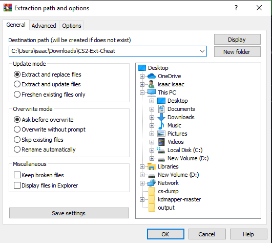
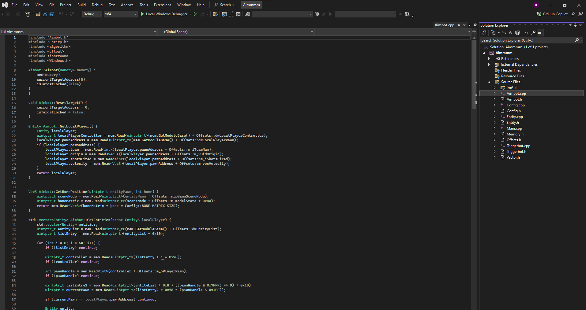
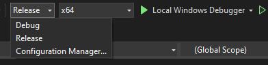
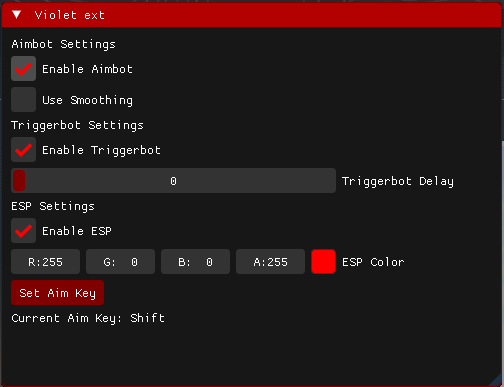
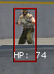

# CS2-Ext
This is the most basic of basic cs2 cheat, I really didnt have much time and it took alot. Dont expect many updates.
# HOW TO RUN
You will first need to extract 

You will then open the .sln and you should see some errors. 

Then switch mode to release 

Then with game running or not build 

Insert to close/open 

Then the exe to run later should be found in a file like this 

C:\Users\xxxxxx\Downloads\CS2-Ext-Cheat\CS2-Ext-Cheat\x64\Release

Where you can then move it to another file

# IM NOT RESPONSIBLE FOR YOU, DONT GET BANNED

# MADE BY ME lucidv61 on DC

